# Log of exemplary workflow
## 1) What we want in the end
Maps from different sources properly layered and manageable the qgis way  
_(sorry for the pixelation of maps w/ unknown (C) state )_  

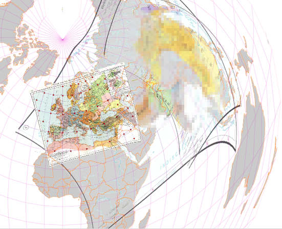

## 2) What we start with

Let's pick a suitable raster for our job:

### `Shepherd_0042.jpg`  
**Source Map**, see https://archive.org/details/HistoricalAtlasWilliamR.Shepherd/page/n1/mode/2up  
Historical Atlas by William R. Shepherd, pg 70/71  
- marked as "opensource" by archive.org
- good quality scan - original close to 40 Mpixel (scaled to 30 % here)
- typical layout of historic atlas, typical continental coverage of europe
- fine graticule
- clear background
- book spline already corrected

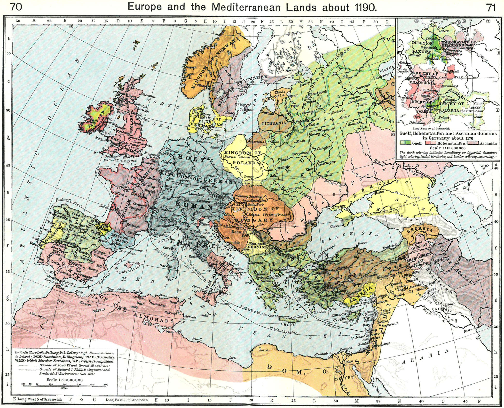

- load source image (jp2) into GIMP, crop, export; optionally coulour enhance, scale
- Launch **QGIS georeferencer** and load this file as raster.
- choose some preliminary CRS that might roughly fit (e. g. `laea` aka *lambert azimuthal equal area* or `eqdc` aka *eqidistant conic*, centered roughly near the area)
- may or may not be the same as in QGIS main canvas
- put **match points at the lat/lon graticule** in the map and enter their **coordinates manually** in **WGS 84** aka **EPSG:4326**
- in the example, I selected all crosspoints along the edges of the map and a 10 x 10 deg raster inbetween
- usually you want to get it done with a fraction of 40 - without loosing precision - that's why we are here


#### Shepherd_0042.jpg.aux.xml
(skd of colour statistic, generated by QGIS georeferencer, not relevant for our case here)
### Shepherd_0042.jpg.points
**point file** containing our **matchpoints** generated by the georeferencer from Shepherd_0042.jpg  
**the focus of our interest**
#### Shepherd_0042.jpg.points_40
copy of points file with as much as 40 matchpoints, as used through most of the walkthrough
#### Shepherd_0042.jpg.points_4
copy of points file with as little as 4 matchpoints, as used for the final step

manually reformated for better readability, this looks like:
```
#CRS:
PROJCRS["unknown",
  BASEGEOGCRS["unknown",
    DATUM["Unknown based on WGS 84 ellipsoid", ELLIPSOID["WGS 84",6378137,298.257223563,LENGTHUNIT["metre",1],ID["EPSG",7030]]],
    PRIMEM["Greenwich",0,ANGLEUNIT["degree",0.0174532925199433],ID["EPSG",8901]]
  ],
  CONVERSION["unknown",
    METHOD["Bonne",ID["EPSG",9827]],
    PARAMETER["Latitude of natural origin",50,ANGLEUNIT["degree",0.0174532925199433],ID["EPSG",8801]],
    PARAMETER["Longitude of natural origin",20,ANGLEUNIT["degree",0.0174532925199433],ID["EPSG",8802]],
    PARAMETER["False easting",0,LENGTHUNIT["metre",1],ID["EPSG",8806]],
    PARAMETER["False northing",0,LENGTHUNIT["metre",1],ID["EPSG",8807]]
  ],
  CS[Cartesian,2],
  AXIS["(E)",east,ORDER[1],LENGTHUNIT["metre",1,ID["EPSG",9001]]],
  AXIS["(N)",north,ORDER[2],LENGTHUNIT["metre",1,ID["EPSG",9001]]]
]

                   mapX   ,                    mapY   ,             sourceX   ,             sourceY  ,enable,              dX   ,                dY   ,    residual
-1264808.11747819161973894,   725798.94674882607068866,  598.62514756747646061,  -485.60985421198654421, 1, -0.3295319391729663 , -0.55583132316644424, 0.64617316467650965
 1264808.11747819161973894,   725798.94674882607068866, 1486.58348090080994552,  -489.12652087865319572, 1,  0.3295319391729663 ,  0.55583132316621686, 0.64617316467631414
-1805300.44668449461460114, -1430455.52371982322074473,  404.85681423414291658, -1252.94652087865347312, 1,  0.23087274608474218,  0.38941992773584388, 0.45271415374659946
 1805300.44668449461460114, -1430455.52371982322074473, 1673.67014756747630599, -1260.33152087865346402, 1, -0.23087274608496955, -0.38941992773584388, 0.45271415374671542
```

In the original file, all the WKT stuff is on a single line, following the ` #CRS:` label.  
Note that the WKT is reproduced from and thus roughly equivalent to the "good old" `proj` notation:  
`+proj=bonne +lat_1=50 +lon_0=20 +ellps=WGS84 +units=m +no_defs +type=crs`

The CSV block with the point parameters is without spaces and matches the table as visible in the georeferencer's GUI.  
`mapX`, `mapY` are the coordinates in the CRS provided - even if we entered them manually as plain integer values in `WGS 84` CRS.  
`sourceX`, `sourceY` are the pixel positions where we placed our match points in the GUI.  

Note that if we change our georef target CRS, `mapX`, `mapY` will change, even if the underlying lat/lon does not change.  
Thus we may watch out for rounding errors and numerical artefacts upon switching target CRS.

## 3) Train our eyes for a visual feeling for atlas CRS

Most of the 7000 CRS in QGIS focus on the **survey** business, with nothing else than **precision** in mind.  
For **atlases**, the technical nuts 'n' bolts are the same. However, the focus is more towards **visual appeal** and **continuity over** larger (typically **continent**al) areas in one image. 

Most atlases in the late 19th ... 20 th century appear to employ **precise projection** techniques, but do **not reveal** them.  
As of my current findings, I think that there are a couple of standard projection types with some special **paramters, optimized** for the **purpose** and **coverage** of each map. Contrary to survey projections, those individual parametrized projections are **not in any catalogue** and thus not included as _predefined CRS_ in QGIS.

The better we match the original projection, the faster and more efficient the georeferencing will work out. A **trained eye** on particularities of different projections is the first valuable tool towards that endeavour.

### Mapping Around
[Mapping Around](https://mappingaround.in/map-projections/) provides an **visually intuitive** insight to the "clever but imperfect art of flattening the earth".
Quite concise, nontheless technically quite complete and correct overview of classifications, including:

- types of surface (i.e. flat, cylindric, conic)
- aspects (i. e. angle of view)
- viewpoints (i.e. distance of view)
- nonperspective variants (such as equidistant, equal area, conformal, compromise)

### map-projections.net
[Compare Map Projections](https://map-projections.net/imglist.php) is a private blog with a lot of 
description and visual comparison of many common projections.

Any **two** selected **projections** can be selected for **mutual visual comparison**, including coastlines, graticules and [Tissot's indicatrix](https://en.wikipedia.org/wiki/Tissot%27s_indicatrix). Toggling between layers reveals even tiny but relevant differences to the eye, that otherwise might escape the attention on adjacent images.

For selected developments of projections, the author provides blog articles with indepth discussions about the "why" and "pro&con".

### QGIS manual
Relevant chapters:

[6. Working with Projections](https://docs.qgis.org/3.40/en/docs/user_manual/working_with_projections/working_with_projections.html)

[11.3. Georeferencer](https://docs.qgis.org/3.40/en/docs/user_manual/managing_data_source/georeferencer.html)

[14.2. Lesson: Georeferencing a Map](https://docs.qgis.org/3.40/en/docs/training_manual/forestry/map_georeferencing.html)

### lipproj

`proj` is the library that performs all the CRS work under the hood of QGIS.  
This page is a list with iconic images for all available CRS: 
[List of all projection images](https://proj.org/en/stable/operations/projections/all_images.html)

### ESRI "Understanding Map Projections"
by Melita Kennedy: [Understanding Map Projections](http://kartoweb.itc.nl/geometrics/Map%20projections/Understanding%20Map%20Projections.pdf)

Comprehensive text, developing and comparing projections, properties and usage.  
Technical entry level, with emphasis on readability, decent coloured images.

### An album of map projections.
[U.S. Geological Survey professional paper 1453](https://pubs.usgs.gov/pp/1453/report.pdf) - First printing 1989, Second printing 1994

similiar, but at intermediary technical level, only black-white images, but including formulas


## 4) Playing with Georef settings
... and try to understand them ...  
We find **circular parallels** on our map. Thus we might head for `eqdc` aka *equidistant conic*.  
A closer look reveals slightly **bent meridians**, too, so we'd go for `LAEA` *(equal area azimuthal)* or it's bretheren instead.  
Searching QGIS standard CRS list, we find **EPSG:3575** *"europe North pole LAEA"* as close enough and use this as **georef target CRS** to start.

### Helmert
Helmert transformation just allows **shift, scale and rotation**.  
Georeferencer calculates more than **80 Pixel deviation** - clearly visible as red lines in the georef UI:

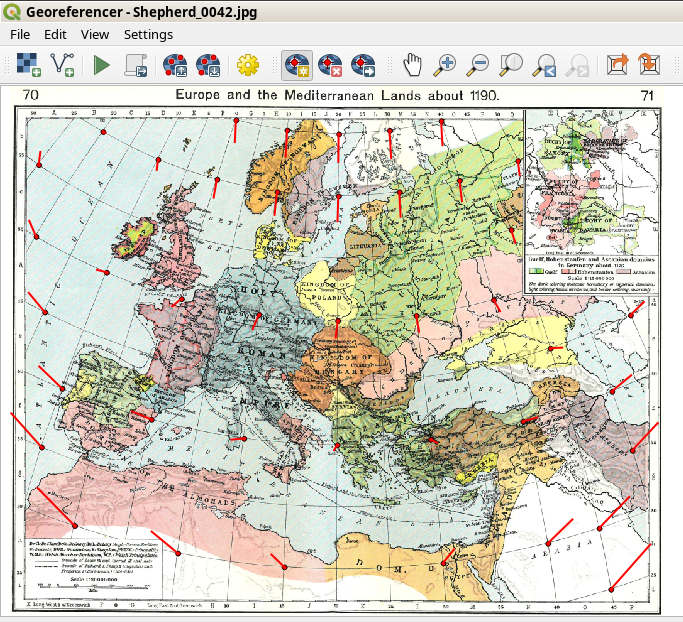  

In the `geotiff` generated by the georeferencer, we find our image rotated  
*(note: I converted the geotif to jpg for memory and bandwith reasons.  )*  
With sth like `exiftool`, we could extract the parameters of mapping from the tif's pixel to target CRS, but this does not help us much in our endeavour.  

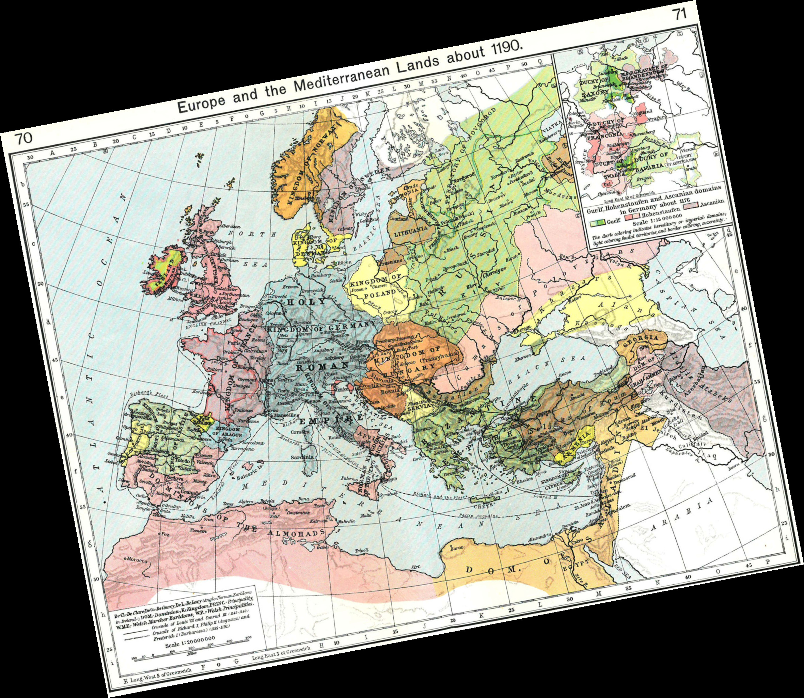  

### Polynomial 1
1st degree polynomials allow different scales for x and y.  
Pixel deviation falls to 52 - still quite some long needles in the map:  

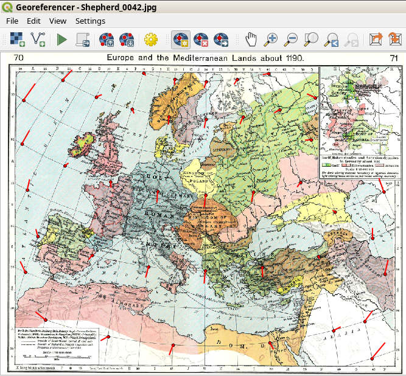  

There is little visual difference to helmert in the geotif, but when we toggle between them in an image viewer, we may watch the change of ratio:  

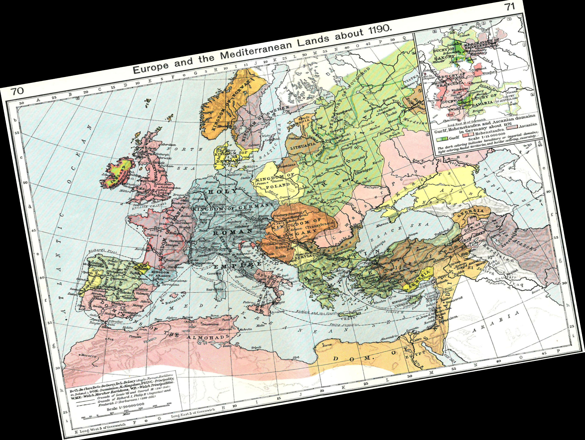  

Showing both layers (Helmert and Poly 1) in QGIS, we notice  
- both images are heavily bent the same way
- the different ratio
- the maps' graticules by far mismatch the correct graticule indicated by the magenta overlay lines
- the red dots are far off the crossings in the graticules
- coast lines are far off their correct positions as visible by the orange overlay
  
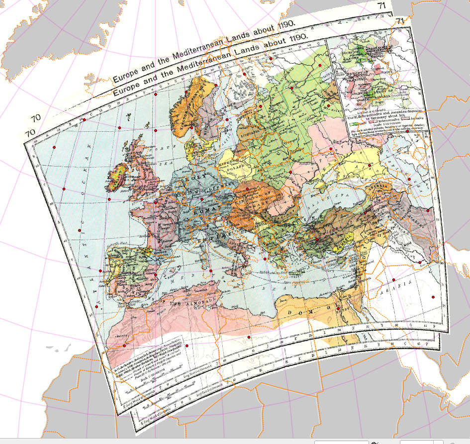  


### Polynomial 2

When we switch to **Polynomial 2**, pixel deviation drastically falls from 52 to 3.5.  
In normal scale, the red needles are barely visible in the UI any more.

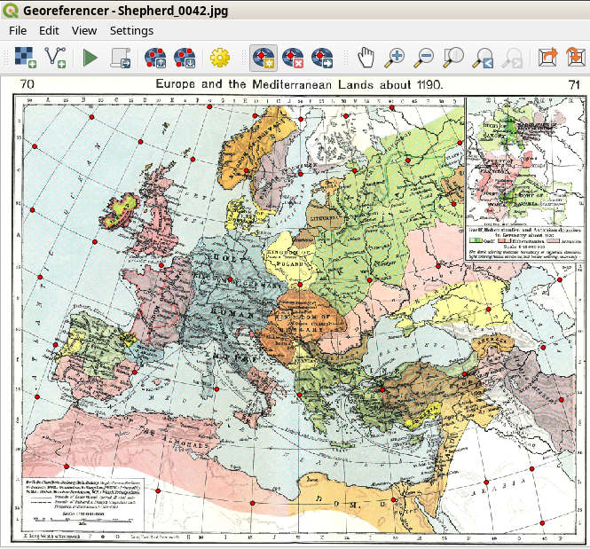

In the `geotiff`, the bending of the image gets obvious.  
It 'somehow looks like' wrapped conus, but not raelly.  
We might take this as clue that what we are relly looking for might be between laea and eqdc.

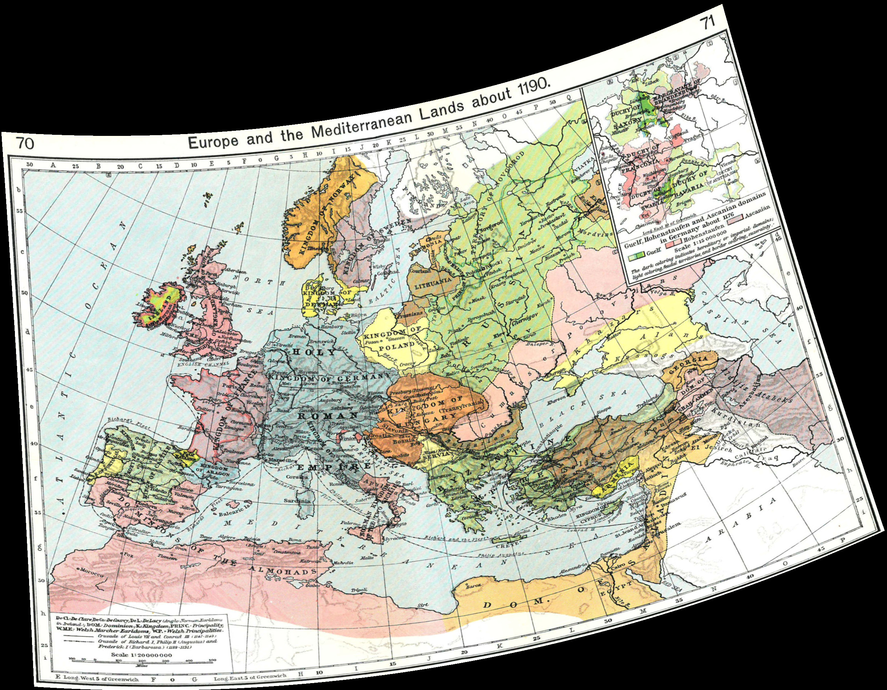

### Polynomial 3

3rd order polynoms allow for even more tweaks like *"blowing"* up the image like a ballon.  
However, compared to poly 2, we see pixel deviation fall from 3.5 to 3.2 merely.  The difference is close to invisible in the UI.
Thus, for the current case, we might stick with the poly 2, if it were not for didactical reasons.  
E.g. for maps much larger than Europe, or distortions from uncorrected book splines, things may differ.

The `geotiff` looks quite similiar to the poly 2 case. Only by toggling or overlaying the images, we notice a slight *"wiggling"* of the corners.


In QGIS (Georeferncer window still active), we find the graticule's crossings neatly placed at the red dots.  
However, we may notice that beyond the dots, towards the edges of the map, the direction of the graticule is misaligned a bit.  
If we play the same game with a lower number of match points, we have to expect larger distortions, again.

I played with different project CRS in QGIS.  
The screenshot below is with ESRI:54024 aka "World_Bonne".  
We find the map projected to near - but not exact - rectangular shape.  
Thus we may conclude that we are quite close to original map producer's CRS.  
If we were able to match this exactly, we might set our georeferencer to low order projections (helmert, poly1), requiring only a small number of matchpoints and introducing no artificial distortions.

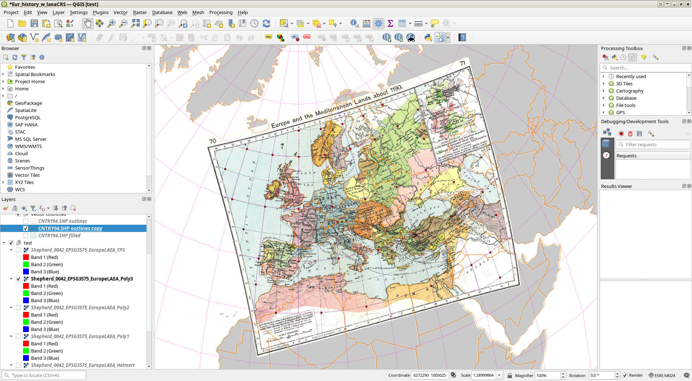

### Thin Plate Spline

Just for curiosity, and we have such a large number of matching points already at hand, we may switch to TPS aka _"rubber sheet"_ mode.  
Pixel deviation falls to some negative exponential I'd consider as zero.  


In QGIS, we may already notice some typical signs of **"overfitting"** i.e. considerable bents at margins and corners and small scale "wiggling" inside the picture.  

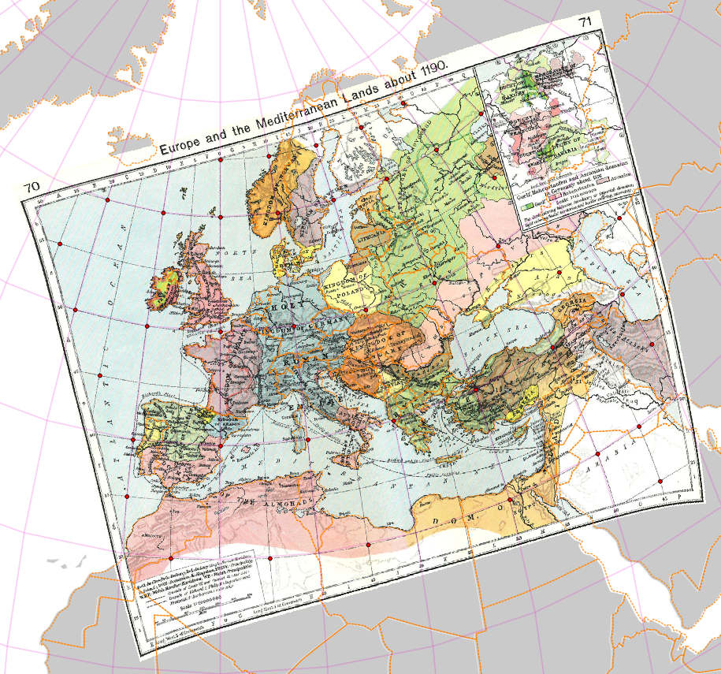

================~~~~~~~~~~~~~~~~~~~~~~~~~
## 5) Try the precision approach

### Least square based optimisation of projection parameters

#### equidistand conic

Based on the experience collected thus far, we try a numeric least square optimisation to identify the projection type and the proper parameters of our test map.
We develop the scripts in the root directory of this project.

On my shelfes, I found a "Diercke" atlas from my kids, one of the rare products listening the projection type and parameter for selected maps.  
For German and European coverages, they employ [equidistant conics](https://proj.org/en/stable/operations/projections/eqdc.html#eqdc) with lat_1 and lat_2 placed around the top and bottom qartiles of the area covered.  

We want to get rid of higher order transformation as far as possible. So Helmert is the first choice.  
Our geometric gut feeling may tell us that for a conical projection, `lat_0` aka **central meridian** (maybe combined with a horizontal shift) is **collinear with rotation**.  
Thus we only allow for shift and scale, not even a rotation.  

We hack the first versions of our scripts and find 
```
+proj=eqdc +lat_0=24.127510 +lon_0=20.633909 +lat_1=31.878340 +lat_2=61.266227 +ellps=intl +units=m +no_defs
||e||_2	 = 5199.21
````
By halfway educated guess, we assume that `||e||_2` is the sum of square of all our 40 x 2 match point coordinates pixel deviation.  
With Pythagoras and euklidean distance in mind, we calculate a mean **error of 11,5 pixel**.  
Much better than the > 80 pixel error from best guess out of QGIS predefined catalog we started with...

#### equidistant azimuthal

... but still not perfect.  
We try to measure **pixel distance** between graticule crossings in GIMP. The results are ... hm ... indifferent.  
But we see that **lateral meridians** are slightly **bent** towards the central one. That's an **argument against conic** projection.  

So next we try an **azimuthal** view. 
Not centered at the north pole, since this would leave straight meridians as well.  
Instead, we expect the **center of projection**, where the plane touches the sphere, somewhere **inside our maps area**.  
Maybe right in the middle, maybe at some even figure in the graticule, maybe at some unknown common reference point in the late card makers collection?  

We don't know, so we ask least square optimisation.  
Regarding the radial projection scheme, our first guess is [azimuthal equidistant](https://proj.org/en/stable/operations/projections/aeqd.html#aeqd).   
We extend our script to provide for rotation. Sadly, for reasons not yet known, it refuses to converge then.  
So we fix rotation at 0, again.  

Thus we get:  
```
+proj=aeqd +lat_0=44.964767 +lon_0=20.440621 +ellps=WGS84 +units=m +no_defs +type=crs
||e||_2	 = 2228.46
```
Mean error calculates to **7.5 pixel**.  
Not bad. The center of projection lies close to lat=45 / lon = 20.5 degrees. 
Close, but not right in the middle of our map. Sounds reasonable at first look.  
Second look compares this to the obvious center of the map at 20 degrees.  
Andy why would a mapmaker decide for this somewhat odd figure as 20.?


#### Lambert's equal area azimuthal

Next try is radial distortion yielding [equal area](https://proj.org/en/stable/operations/projections/laea.html#laea). 
```
+proj=laea +lat_0=45.792803 +lon_0=20.436423 +ellps=WGS84 +units=m +no_defs +type=crs
||e||_2	 = 2008.09
```
Mean error slightly decreases to **7.1 pixel**.  Would be nice to ask a trained statistician about significance... anyway...  

The known arguments for [LAEA](https://en.wikipedia.org/wiki/Lambert_azimuthal_equal-area_projection) (visual weight of remote areas, complete coverage of the globe) do not hold for the map at hand. Might we question a decision for this choice?


#### Orthographic azimuthal

[Orthographic projection](https://proj.org/en/stable/operations/projections/ortho.html#ortho) resembles the view towards the globe from a remot point. Thus it might be considered as naturally intuitive. It provides for bent meridians and slightly decrasing distances for remote points - similiar but a bit less than LAEA. It hides half of the globe, but for an European extent, this would not hurt.

We get
```
+proj=ortho +lat_0=46.850619 +lon_0=20.417397 +ellps=WGS84 +units=m +no_defs +type=crs
||e||_2	 = 2974.06
```
i.e. **mean error 8.6 pixel** "smells significantly" worse ... surprisingly. Hm ... 

#### Bonne

https://proj.org/en/stable/operations/projections/bonne.html#bonne

#### Comparing optimised results with first guess

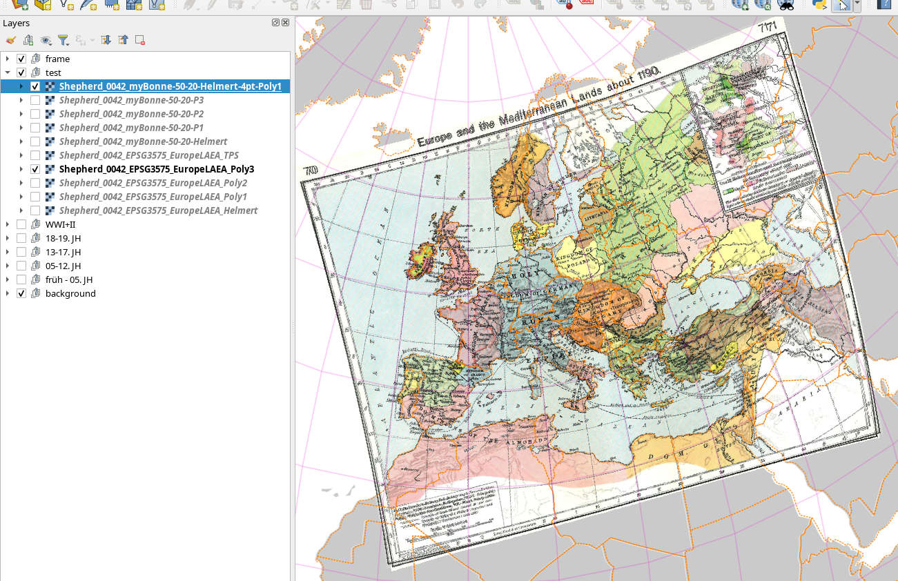


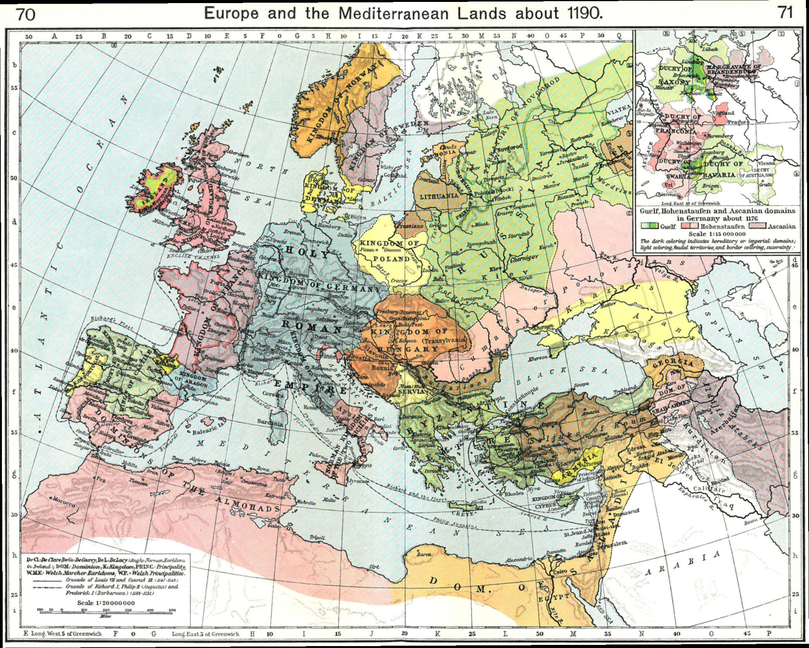


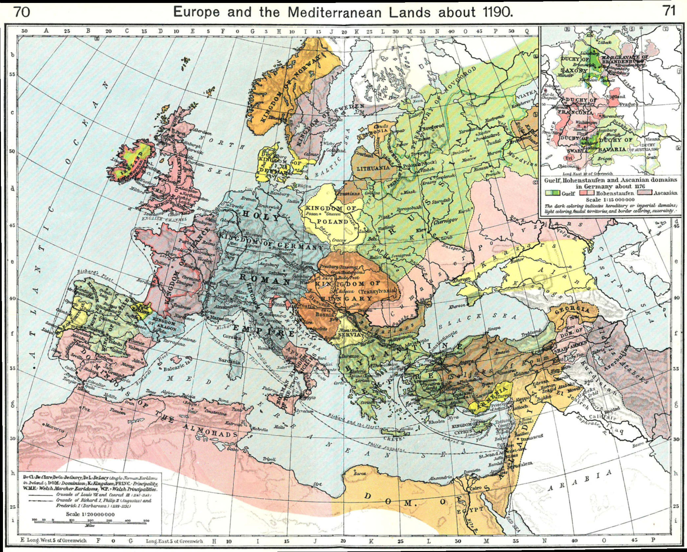
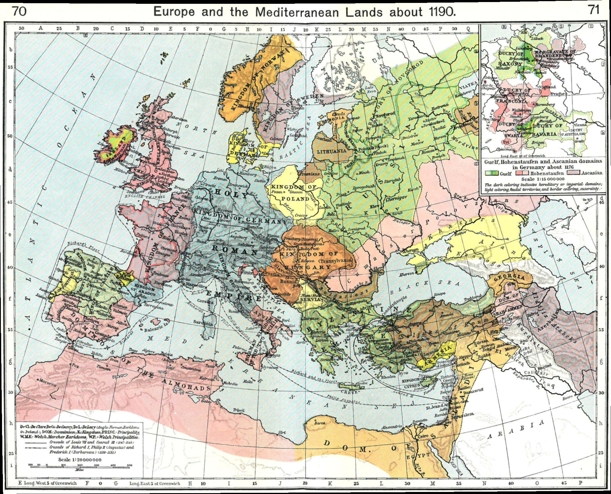


